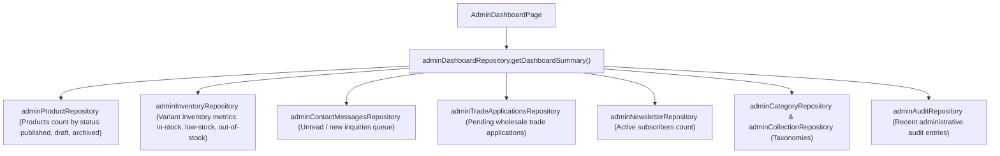

# Phase 2.12 Completion Report: Real Admin Dashboard & Immutable Audit Trail

**Date**: 2026-08-26  
**Branch**: `phase-2`  
**Quality Status**: ✅ ALL GATES PASSED (Line limits, repo safety, ESLint, TypeScript, 87/87 Vitest suites [479 tests], 38 pgTAP DB tests, Vite production build)

---

## 1. Executive Summary

Phase 2.12 completes the Admin experience with two core operational requirements:
1. **Real Data-Driven Dashboard**: Completely replacing temporary scaffolds with genuine, repository-backed business metrics. Adheres strictly to the absolute integrity rule: **Zero fake revenue, zero fake orders, zero fake shipment numbers, and zero fabricated sales charts**.
2. **Immutable Admin Audit Trail**: Implemented an append-only, tamper-proof audit log ledger (`public.admin_audit_logs`) enforced by database-level triggers, restrictive RLS policies (`SELECT` restricted to `is_admin()`), a `SECURITY DEFINER` event logger function (`public.log_admin_audit_event`), and PII-safe metadata redaction.
3. **Admin Submissions Management**: Provided full-lifecycle management for contact messages, wholesale trade applications, and newsletter subscriptions with strict preservation of the server-side Supabase Edge Function ingestion boundary.

---

## 2. Real Dashboard Architecture & Metric Queries

The Admin Dashboard (`src/admin/pages/AdminDashboardPage.tsx`) aggregates live business metrics via `adminDashboardRepository.getDashboardSummary()`. It executes concurrent, repository-level queries across all genuine domain models:



### Real Dashboard Metrics Displayed:
- **Ürün Kataloğu**: Total product count, breakdown of published vs. draft products.
- **Stok & Varyantlar**: Total inventory variants, count of in-stock variants, critical alert indicator for low-stock (≤ 5 units) and out-of-stock variants.
- **Gelen Talep & Başvuru**: Combined incoming queue counter showing new contact messages and pending wholesale applications.
- **Bülten & Kitle**: Active newsletter subscriber count and taxonomy totals (active categories & collections).
- **Son Denetim & Yönetim Olayları**: Live timeline of recent admin events (actor, entity type, action type, timestamp).
- **Yönetim Kısayolları**: Fast navigation hub to all functional admin modules.
- **Güvenlik & Veritabanı Durumu**: Live status indicator verifying PostgreSQL RLS, Admin RBAC, and Audit Trail state.

### Explicit Integrity Guarantee:
- Absolutely **no fake financial revenue** (e.g. `₺148,000`), **no imaginary order counts**, **no fake shipments**, and **no mock sales graphs** are rendered.

---

## 3. Immutable Audit Trail Architecture

The audit trail is permanently anchored in PostgreSQL schema and application services:

### 3.1 Migration Schema (`20260826070000_phase2_admin_audit.sql`)
- **Table**: `public.admin_audit_logs`
  - Fields: `id`, `actor_user_id`, `actor_email`, `action` (`CREATE`, `UPDATE`, `DELETE`, `STATUS_CHANGE`, `SETTINGS_UPDATE`), `entity_type`, `entity_id`, `entity_name`, `safe_metadata` (JSONB), `ip_address`, `user_agent`, `created_at`.
- **Database Immutability Trigger**:
  - `trg_prevent_audit_mutation` fires `BEFORE UPDATE OR DELETE` on `admin_audit_logs` and executes `public.enforce_audit_log_immutability()`, throwing an uncatchable PostgreSQL exception `27000 (cannot_coerce)`.
- **Row-Level Security (RLS)**:
  - `ENABLE ROW LEVEL SECURITY;`
  - `SELECT` policy restricted strictly to `public.is_admin()`.
  - Zero `INSERT`, `UPDATE`, or `DELETE` grants given to `anon` or `authenticated` roles directly on the table.
- **Trusted Logging RPC**:
  - `public.log_admin_audit_event(...)` `SECURITY DEFINER` function with search_path lockdown (`SET search_path = public, auth, pg_temp;`). Captures `auth.uid()` and authenticated user email server-side.

### 3.2 Safe Metadata & Zero-PII Policy
- Audit events record high-level changes (e.g., changed keys, previous/new status, quantity diffs, publication state).
- Sensitive customer data (passwords, payment details, full raw contact messages, tax identification data, subscriber email lists) is **never** duplicated into audit metadata.

### 3.3 Admin Audit Interface (`/admin/audit`)
- Real filterable table and activity timeline.
- Action type filters (`CREATE`, `UPDATE`, `DELETE`, `STATUS_CHANGE`, `SETTINGS_UPDATE`).
- Entity type dropdown filter (`product`, `variant`, `wholesale_tier`, `category`, `collection`, `page`, `faq`, `settings`, `menu_group`, `trade_application`, `contact_message`, `newsletter_subscription`).
- Full search across actor email, entity name, and entity ID.
- Detail inspection modal displaying formatted metadata, actor credentials, and immutability verification seal.

---

## 4. Submissions Management Module (`/admin/submissions`)

Preserves the absolute security rule: **No public direct PostgreSQL INSERT permissions**. All client submissions continue to flow strictly via Supabase Edge Functions with server-side validation.

- **İletişim Mesajları (Contact Messages)**:
  - List with search, pagination, status filtering (`new`, `in_review`, `resolved`, `archived`).
  - Detail modal with admin notes and reviewed timestamp.
  - Outbound email notice reminding administrators to respond via official mail client (no fake mail mock buttons).
- **Toptan Başvuruları (Trade Applications)**:
  - List with status filtering (`pending`, `approved`, `rejected`, `more_info_needed`).
  - Company profile, tax office, tax number, annual revenue estimate, target product categories.
  - Clear architectural notice: "Application approval updates application status record without assuming automatic customer portal account provisioning".
- **E-Bülten Aboneleri (Newsletter Subscriptions)**:
  - Search by email address, source filtering, and one-click active/unsubscribed toggle.
  - PII protected with safe display conventions.

---

## 5. Verification & Test Suite Execution

All quality gates passed with zero warnings and zero failures:

```bash
> npm run check:lines
✅ All 322 source files comply with the 600-line hard limit.

> npm run check:repo
✅ Repository safety check PASSED. No prohibited files or exposed secret patterns detected.

> npm run lint
✅ ESLint passed with 0 errors and 0 warnings.

> npm run typecheck
✅ tsc -b passed with 0 errors.

> npm run test:db
✅ Database security test suite (38 pgTAP assertions) validated successfully.

> npm run test
Test Files  87 passed (87)
Tests       479 passed (479)

> npm run build
✓ 1792 modules transformed.
✓ built in 5.65s
```

---

## 6. Commit Summary

1. `feat(admin): add real dashboard and immutable audit trail`
2. `docs(report): add phase 2.12 report`
Branch: strictly `phase-2`. No main operations.
